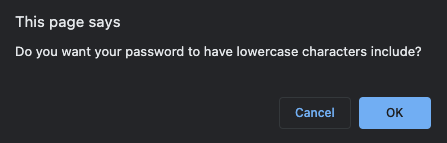

# Password Generator User Story

AS AN employee with access to sensitive data
I WANT to randomly generate a password that meets certain criteria
SO THAT I can create a strong password that provides greater security

# Acceptance Criteria

GIVEN I need a new, secure password
WHEN I click the button to generate a password
THEN I am presented with a series of prompts for password criteria

WHEN prompted for the length of the password
THEN I choose a length of at least 8 characters and no more than 128 characters

WHEN prompted for password criteria
THEN I select which criteria to include in the password

WHEN prompted for character types to include in the password
THEN I choose lowercase, uppercase, numeric, and/or special characters

WHEN I answer each prompt
THEN my input should be validated and at least one character type should be selected

WHEN all prompts are answered
THEN a password is generated that matches the selected criteria

WHEN the password is generated
THEN the password is either displayed in an alert or written to the page

# Features

## Generate Password Screen and Button 

Allowing the user to select when to generate password.

## Password Length and Input Validation

Asks the user to confirm PW length between 8-128, and confirms that the input is within range and is a number.

## Password Criteria Selection

Asks the user to confirm what criteria the password should contain, uppercase, lowercase, numeric, special characters.

Then validates that at least one has been selected. If not notifies user.

## Generates Random Password

A password is generated based on user criteria and is displayed on the screen.

# Link to Git Hub

https://github.com/mp2626/password_generator

# Link to Site

https://mp2626.github.io/password_generator/

# Programming Languages

* HTML
* CSS
* JavaScript

# Authors
Contributor - Michael Perrin